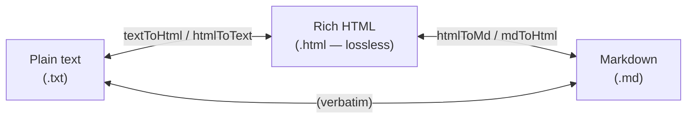
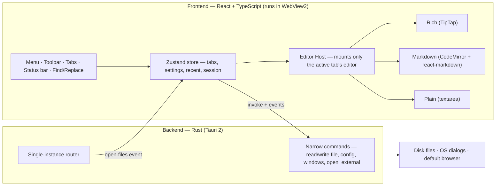

# Noteview

**A lightweight, Markdown‑first replacement for Windows Notepad** — with Word‑like rich‑text
formatting, live Markdown preview, rendered LaTeX math, GFM tables, code highlighting, and
first‑class Arabic / RTL support. It runs **fully offline** and installs in a few megabytes.


> Notepad is too bare; a word processor is too heavy. Noteview sits in the middle: open any
> `.md`, `.txt`, or `.html` file instantly, read it *rendered*, and edit it either as plain
> text, as Markdown with a live preview, or as fully formatted rich text — your choice, per
> tab, with no cloud, no account, and no telemetry.

---

## Table of contents

- [What is Noteview?](#what-is-noteview)
- [Why it exists (purpose)](#why-it-exists-purpose)
- [Features](#features)
- [The big idea: one document, three modes](#the-big-idea-one-document-three-modes)
- [Concepts & terminology](#concepts--terminology)
- [How it works (architecture)](#how-it-works-architecture)
- [Tech stack](#tech-stack)
- [Project structure](#project-structure)
- [Getting started](#getting-started)
- [Usage](#usage)
- [Keyboard shortcuts](#keyboard-shortcuts)
- [File formats](#file-formats)
- [Settings & where data is stored](#settings--where-data-is-stored)
- [Security & privacy](#security--privacy)
- [Internationalization (i18n) & RTL](#internationalization-i18n--rtl)
- [Known limitations](#known-limitations)
- [Development](#development)
- [License](#license)

---

## What is Noteview?

Noteview is a **native Windows desktop editor** for everyday text and notes. It is built to
*replace* Windows Notepad as the default app for Markdown, plain‑text, and simple HTML
documents, while adding the things Notepad never had:

- a **rendered** view of your content (formatted text, tables, math, code) instead of raw markup;
- **three editing modes** per document — Rich text, Markdown, and Plain text — that you can
  switch between freely;
- proper **Markdown** support (GitHub‑flavored), including a live side‑by‑side preview;
- rendered **LaTeX math** (via KaTeX) in both rich text and Markdown;
- genuine **Arabic / right‑to‑left** support throughout the editor and the app's own interface.

It is a [Tauri 2](https://tauri.app) application: a small **Rust** backend paired with a
**React + TypeScript** frontend that renders inside the operating system's built‑in
**WebView2**. Because it reuses the OS web engine instead of bundling a whole browser (as an
Electron app would), the installed footprint is a few megabytes rather than hundreds.

## Why it exists (purpose)

| You want to… | Notepad | Word / Office | **Noteview** |
| --- | :---: | :---: | :---: |
| Open a `.md`/`.txt` file *instantly* | ✅ | ❌ (slow, heavy) | ✅ |
| See Markdown **rendered** (tables, math, code) | ❌ | ⚠️ | ✅ |
| Edit as rich text *and* as Markdown source | ❌ | ⚠️ | ✅ |
| Write **LaTeX math** that actually renders | ❌ | ⚠️ | ✅ |
| First‑class **Arabic / RTL** | ⚠️ | ✅ | ✅ |
| Work **fully offline**, no account/telemetry | ✅ | ⚠️ | ✅ |
| Stay tiny (MBs, not GBs) | ✅ | ❌ | ✅ |

The goal is a fast, beautiful, **offline‑first** editor that is pleasant for quick notes *and*
capable enough for formatted documents, README files, and bilingual (Arabic/English) writing —
without sending your text anywhere.

## Features

**Notepad parity, modernised**
- Multi‑tab **and** multi‑window (all in a single process)
- New / Open / Save / Save As / Save All, with **recent files**
- **Find & Replace** with match‑case, whole‑word and **regex**; Find next/previous; **Go to line**
- Word wrap, text **zoom**, a toggleable status bar (line/column, word/char counts, mode)
- **Print** and **Page setup**; UTF‑8 with a **BOM‑safe** reader; unsaved‑changes prompts
- **Session restore** — your tabs (including unsaved edits) and the active tab come back after a restart

**Rich‑text mode (WYSIWYG)**
- Font family & size, **bold / italic / underline / strikethrough**, text colour & highlight colour
- Paragraph alignment, bullet / numbered / **task** lists, headings, blockquotes, code blocks
- **Tables** — insert, add/remove rows & columns, merge & split cells
- Editable inline and block **LaTeX** — double‑click a formula to edit its source
- Links, and **clear formatting** (via the Edit menu)

**Markdown mode**
- A **CodeMirror 6** source editor with syntax highlighting, beside a **live preview**
- **Source / Split / Preview** layouts with scroll‑sync
- GitHub‑Flavored Markdown: tables, task lists, `~~strikethrough~~`, autolinks
- `$inline$` and `$$block$$` math, fenced‑code syntax highlighting, images & links

**Shared & cross‑cutting**
- **One math engine (KaTeX)** shared by rich mode and the Markdown preview, so formulas look
  identical everywhere; invalid LaTeX shows an inline error instead of crashing
- **Automatic text direction** — each paragraph picks LTR/RTL from its own content, so mixed
  Arabic + English + numbers + math lay out correctly with no manual switching
- **Full localisation** (English + Arabic); switching the app language to Arabic flips the
  **entire UI to RTL** live
- Light & dark **themes**, a custom app icon, persistent settings
- **Export** to `.docx` (best‑effort) and `.pdf` (high‑fidelity, via the WebView print path)

## The big idea: one document, three modes

Every open document is one **tab**, and every tab is in exactly one **mode** at a time:



- **Rich** — content is stored as **HTML** (the lossless rich format).
- **Markdown** — content is stored as **Markdown source**.
- **Plain** — content is stored as **raw text**.

When you switch a tab's mode, its content is **converted** to the new mode's representation;
when you save or export, the content is converted to the **target file format**. This is why
`.html` is the *lossless* rich format (it round‑trips fonts, colours, tables, alignment and
math), while `.md` keeps only what Markdown can express and `.txt` keeps only the text. See
[File formats](#file-formats) for the details.

## Concepts & terminology

| Term | What it means in Noteview |
| --- | --- |
| **Tab** | One open document. Holds its path, name, mode, content, dirty flag, encoding, and cursor. |
| **Mode** | How a tab is being edited: **Rich**, **Markdown**, or **Plain**. Switchable per tab. |
| **Content model** | Each tab's content is the *native* representation of its current mode (HTML / Markdown / text). Conversions happen only at the edges (mode switch, save, export). |
| **Lossless rich format** | `.html` — saving rich content to HTML and reopening it restores everything exactly. |
| **Dirty** | A tab with unsaved changes (shown as a dot on the tab). Closing a dirty tab prompts to save. |
| **Session** | The set of open tabs + the active tab, persisted so a restart restores your workspace. |
| **Rich editor** | The WYSIWYG editor, built on **TipTap** (which is built on **ProseMirror**). Serialises to HTML. |
| **Markdown editor** | A **CodeMirror 6** source pane + a **react‑markdown** live preview. |
| **KaTeX** | The math typesetting engine. Renders **LaTeX** for both rich math nodes and the Markdown preview. |
| **GFM** | GitHub‑Flavored Markdown — tables, task lists, strikethrough, autolinks. |
| **BOM** | Byte‑Order Mark. Noteview detects/preserves UTF‑8/UTF‑16 BOMs so files round‑trip byte‑for‑byte. |
| **Bidi / RTL / LTR** | Bidirectional text. Direction is **auto per paragraph** (`unicode-bidi: plaintext`): each paragraph self‑detects from its first strong character. |
| **App UI direction** | Separate from document direction — it follows the **app language** (Arabic ⇒ RTL chrome). |
| **Tauri command** | A narrow Rust function the frontend may call (e.g. read/write a file). The only bridge to the OS. |
| **Capability** | A Tauri v2 permission grant. Noteview grants the webview *only* the few it actually uses. |
| **CSP** | Content‑Security‑Policy — restricts what the webview may load/execute (hardened for offline use). |
| **Single‑instance** | Only one Noteview process runs; opening another file routes it into the existing window as a new tab. |
| **WebView2** | The Microsoft Edge–based web engine built into Windows that renders the frontend. |

## How it works (architecture)

Noteview is a single window with a thin, least‑privilege Rust service behind it.



**Rust ⇄ frontend boundary.** All file I/O goes through a *small set of narrow commands*
(BOM‑safe `read_file` / `write_file`, `write_bytes` for binary `.docx`, app‑config read/write,
`take_startup_files`, `open_new_window`, `open_external`, `quit_app`) rather than a broad
filesystem plugin — deliberately *more* least‑privilege for an editor that opens arbitrary user
files. Opening a file from Explorer works via the single‑instance plugin: a second launch
routes its path to a running window, which adds it as a new tab.

**State is split by update frequency.** A serialisable **Zustand** store owns tabs, settings,
recent files and the persisted session; smaller stores hold the active editor's imperative
command handle, the live rich‑editor instance, and transient UI flags (find/goto/settings).

**The editor host** mounts only the *active* tab's editor, keyed by tab + mode, so switching
either remounts a fresh editor. Three editors — Rich (TipTap), Markdown (CodeMirror +
react‑markdown), Plain (textarea) — each register a command handle (for the menu) and a search
adapter (for the shared Find/Replace engine).

**One content model, converted at the edges.** Each tab's content is the native representation
for its mode; switching mode or saving converts via `marked` (Markdown → HTML), `turndown`
(HTML → Markdown), and DOM‑based HTML ↔ text helpers, with **DOMPurify** sanitising any HTML.

**Shared rendering.** KaTeX is the single math engine, and one Markdown renderer feeds both the
live preview and export/print, so math and typography are identical everywhere.

**Offline guarantee.** All fonts and KaTeX assets are bundled; a strict production CSP forbids
loading remote scripts/styles. The only runtime network use is *user content* you opt into
(e.g. an image URL in your Markdown, or "search the web for selection").

## Tech stack

**Backend (Rust / Tauri 2)** — `tauri`, `tauri-plugin-single-instance`, `tauri-plugin-dialog`,
`tauri-plugin-opener`, `encoding_rs` (encoding/BOM), `base64`, `url` (link‑scheme allowlisting).

**Frontend (React 19 + TypeScript 5.8 + Vite 7)**

| Area | Libraries |
| --- | --- |
| Rich editor | `@tiptap/*` (StarterKit, table, text‑style/color/font, highlight, text‑align, lists) on ProseMirror |
| Markdown | `codemirror` 6 (`@codemirror/*`), `react-markdown`, `remark-gfm`, `remark-math`, `rehype-katex`, `rehype-highlight` |
| Math | `katex` |
| Conversion | `marked`, `turndown`, `turndown-plugin-gfm`, `dompurify` |
| Export | `@turbodocx/html-to-docx` (`.docx`), `jspdf` + `html2canvas` (PDF helpers) |
| State / i18n / icons | `zustand`, `i18next` + `react-i18next`, `lucide-react` |
| Fonts (bundled) | `@fontsource/*` — Inter, Lora, JetBrains Mono, Noto Naskh Arabic, Amiri |

## Project structure

```
Noteview/                       ← repository root (this README)
├─ app/                         ← THE APPLICATION (npm project — run commands here)
│  ├─ src/                      ← frontend
│  │  ├─ components/            ← MenuBar, TabBar, Toolbar, Settings, FindReplace, …
│  │  │  └─ editors/            ← RichEditor, MarkdownEditor, PlainEditor (+ extensions/math)
│  │  ├─ state/                 ← Zustand stores: store, editorBridge, richEditor, ui
│  │  ├─ lib/                   ← tauri wrappers, convert, search, bidi, files, export
│  │  ├─ i18n/                  ← en.json, ar.json (UI strings)
│  │  └─ styles/                ← tokens.css (theme) + app/editor/base CSS
│  ├─ src-tauri/                ← Rust backend, tauri.conf.json, capabilities/, icons/
│  ├─ scripts/                  ← CDP smoke tests (smoke.mjs, smoke-ui.mjs)
│  └─ package.json, README.md   ← app/README.md is the terse run/build quickref
├─ audits/                      ← security/QA audit reports
├─ handoffs/                    ← dated per‑session work logs
├─ Noteview.exe                 ← generated portable launcher (build output)
└─ Noteview-Setup.exe           ← generated installer (build output)
```

## Getting started

> All npm commands run from the **`app/`** directory.

### Prerequisites
- **Node.js** 18+ and npm
- **Rust** (stable) via [rustup](https://rustup.rs)
- **Microsoft Visual C++ Build Tools** ("Desktop development with C++" workload) — the MSVC
  toolchain Rust links against on Windows
- **WebView2 runtime** — already present on Windows 11 and current Windows 10

### Run from source
```bash
cd app
npm install
npm run tauri dev       # starts Vite + launches the desktop window
```

### Build installers
```bash
cd app
npm run tauri build
```
Produces, under `app/src-tauri/target/release/bundle/`:
- `msi/Noteview_0.1.0_x64_en-US.msi` — WiX MSI installer
- `nsis/Noteview_0.1.0_x64-setup.exe` — NSIS installer

Both register Noteview for `.md`, `.markdown`, `.txt`, `.html`, `.htm` and bundle the WebView2
bootstrapper. (The root `Noteview.exe` / `Noteview-Setup.exe` are copies of the release outputs.)

### Type‑check / verify (the quality gate)
There is **no test runner**; correctness is gated by the type‑checkers plus optional runtime smoke scripts:
```bash
cd app && npx tsc --noEmit                 # frontend types (strict)
cd app/src-tauri && cargo check            # Rust
node app/scripts/smoke.mjs                 # optional: CDP runtime checks
```

## Usage

### Make Noteview the default for Markdown
1. Right‑click a `.md` file → **Open with → Choose another app**.
2. Pick **Noteview** and tick **Always use this app to open .md files**
   (or **Settings → Apps → Default apps → Choose defaults by file type**).

Double‑clicking a file then opens it in Noteview. Because Noteview is **single‑instance**,
opening another file while it's running adds a **new tab** to the existing window rather than
spawning a second process.

### Switching modes
Use the mode switch on the right of the toolbar to move a tab between **Rich text**,
**Markdown**, and **Plain text**. Markdown tabs also get a **Source / Split / Preview** switch.

### Exporting
- **PDF** — File ▸ Print (or *Export to PDF*) uses the WebView print dialog's "Save as PDF",
  preserving fonts and vector math at the highest fidelity, fully offline.
- **Word** — File ▸ Export to Word (`.docx`) is best‑effort (see [Known limitations](#known-limitations)).

## Keyboard shortcuts

| File | | Edit | | View |
| --- | --- | --- | --- | --- |
| New tab `Ctrl+N` | | Undo `Ctrl+Z` | | Zoom in `Ctrl+=` |
| New window `Ctrl+Shift+N` | | Redo `Ctrl+Y` | | Zoom out `Ctrl+-` |
| New Markdown tab `Ctrl+Shift+M` | | Cut/Copy/Paste `Ctrl+X/C/V` | | Reset zoom `Ctrl+0` |
| Open `Ctrl+O` | | Select all `Ctrl+A` | | |
| Save `Ctrl+S` | | Find `Ctrl+F` | | |
| Save As `Ctrl+Shift+S` | | Replace `Ctrl+H` | | |
| Save All `Ctrl+Alt+S` | | Find next / prev `F3` / `Shift+F3` | | |
| Print `Ctrl+P` | | Go to line `Ctrl+G` | | |
| Close tab `Ctrl+W` | | | | |
| Close window `Ctrl+Shift+W` | | | | |

## File formats

| Extension | Opens as | Notes |
| --- | --- | --- |
| `.md`, `.markdown` | Markdown mode | Markdown is the source of truth |
| `.txt` | Plain (or rich, per Settings) | Plain text holds no formatting |
| `.html`, `.htm` | Rich mode | **Lossless native rich format** |

**`.html` is the lossless rich format.** Saving a rich document as `.html` preserves fonts,
colours, highlights, tables, alignment and LaTeX, and reopening restores them exactly. Saving
as `.md` keeps only Markdown‑native formatting (bold/italic/strikethrough, headings, lists,
tables, links, code, math); colour/highlight/font/underline have no Markdown syntax and are
dropped — use `.html` to keep them. Plain text keeps only the text. All reads/writes are UTF‑8.

## Settings & where data is stored

Settings (theme, language, default mode, default font & size, word wrap, default save format,
spell‑check + dictionary, autocorrect, paper size & margin) live in the **per‑user app‑config
directory**:

```
%APPDATA%\ae.aperion.noteview\
├─ settings.json   ← preferences
├─ recent.json     ← recent files
├─ page.json       ← page setup (paper size, margin)
└─ session.json    ← open tabs + active tab (workspace restore)
```

Each config file is parsed independently, so a corrupt file falls back to defaults instead of
blocking startup.

## Security & privacy

- **Offline‑first.** No account, no telemetry. Fonts and math assets are bundled; a strict
  production **CSP** forbids loading remote scripts or styles.
- **Least‑privilege backend.** The webview is granted only the handful of Tauri capabilities it
  actually uses — no broad filesystem, shell, or HTTP access.
- **Narrow command surface.** All OS access goes through a few audited Rust commands.
- **Sanitised HTML.** Opened/converted HTML is run through **DOMPurify**; the Markdown preview
  does not render raw HTML, so embedded scripts stay inert.
- **Scheme allow‑listing.** Opening external links is restricted to `http`, `https`, and
  `mailto` — `javascript:`, `file:`, and arbitrary protocols are refused.
- The only runtime network use is **user content** you opt into (a remote image URL in your
  Markdown, or "search the web for selection", which opens your browser).

## Internationalization (i18n) & RTL

- Every UI string is localised through `i18next`; translations live in `app/src/i18n/*.json`
  (English and Arabic ship today). Adding a language is dropping in a new JSON file.
- **App UI direction** follows the chosen language (Arabic ⇒ the whole interface flips to RTL).
- **Document direction is automatic per paragraph** (`unicode-bidi: plaintext`): each paragraph
  picks LTR or RTL from its own first strong character, so a single document can mix Arabic and
  English lines correctly — there is no manual direction control to fiddle with.

## Known limitations

- **`.docx` export is best‑effort** — headings, bold/italic, lists, tables, links and images
  convert well; LaTeX is exported as its source text (Word has no KaTeX). For pixel‑perfect
  math, export to **PDF** instead.
- **PDF export uses the system print dialog** (highest fidelity, fully offline) rather than
  writing a file silently.
- **Markdown → rich** restores Markdown‑native formatting; colour/highlight/font are `.html`‑only.
- **First install on an air‑gapped machine** may need to fetch the WebView2 runtime once; the
  app itself runs fully offline thereafter. (WebView2 ships with Windows 11 / current Windows 10.)
- The colour palette is an intentionally neutral, brand‑agnostic editor theme, re‑themable via
  `app/src/styles/tokens.css`.

## Development

- **Frontend:** strict TypeScript (no `any` in core), Vite, React 19. `npx tsc --noEmit` must be
  clean. UI strings go through `t(...)` and must exist in **both** `en.json` and `ar.json`.
- **Backend:** Rust + Tauri v2; `cargo check` must be clean. New capabilities are added only when
  a webview call truly needs them.
- **Verification:** no unit‑test runner — `tsc` + `cargo check` + `npm run tauri build`, plus the
  CDP smoke scripts in `app/scripts/` (`smoke.mjs`, `smoke-ui.mjs`) that drive the built binary.
- **Docs:** architecture/conventions in [`CLAUDE.md`](CLAUDE.md); the terse run/build card in
  [`app/README.md`](app/README.md); dated work logs in [`handoffs/`](handoffs/).

## License

Noteview is licensed under the **GNU General Public License v3.0** — see [`LICENSE`](LICENSE).

Copyright © 2026 **Ali Al Hemeiri**.

You may use, study, modify, and redistribute it (including commercially) **provided that** you
keep this copyright/attribution, license any derivative work under GPL-3.0, and make your
modified source available. In short: build on it freely — but credit the author and keep it open.
